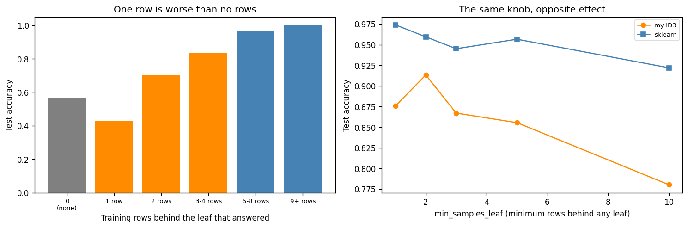

## ML From Scratch

### Overview

Two things a machine learning library normally does for you, written out by hand instead:
**preprocessing** on a 100,000-row credit dataset, and the **ID3 decision tree algorithm** on a
categorical classification problem.

The hand-written tree scores 87.6%. `sklearn.tree.DecisionTreeClassifier` scores 97.4% on the same
split. **This repository is about finding out exactly where those ten points go** — and the answer
comes from editing my own stopping rule, which is not something you can do to a library.

The short version: the criterion isn't it, the encoding isn't it, and the tree isn't too small.
The errors all come from leaves built on almost no evidence — **a leaf built from one training row
is less accurate than a leaf built from none.** Adding a minimum-evidence rule to `build_tree`
recovers 3.8 of the 10 points and cuts the train-test gap from 12.4 to 4.8. The same rule gives
scikit-learn nothing back.

### Technical Implementation
* ****Language****: Python
* ****Libraries****: pandas, `math` (notebooks 01–02, no ML library); scikit-learn, matplotlib (notebook 03 only)
* ****Tools****: Jupyter Notebook

### What is in here

| Notebook | Data | What it does |
|---|---|---|
| `01_preprocessing_from_scratch.ipynb` | Credit Score, 100,000 rows | Missing and corrupted values, z-score normalisation, equal-frequency binning, one-hot encoding — pandas only |
| `02_decision_tree_from_scratch.ipynb` | Car Evaluation, 1,728 rows | Entropy, information gain, recursive tree induction, classifier — pandas and `math` only |
| `03_vs_sklearn.ipynb` | Car Evaluation | Diagnosing the gap against `DecisionTreeClassifier`, then fixing the stopping rule to confirm the diagnosis |

Datasets: [Credit Score Classification](https://www.kaggle.com/datasets/parisrohan/credit-score-classification)
and [Car Evaluation](https://archive.ics.uci.edu/dataset/19/car+evaluation) (UCI).

Notebooks 01 and 02 were written for a data mining course where no machine learning library was
permitted, which is why every step is implemented rather than imported. Notebook 03 is the
follow-up that constraint made possible.

### Notebook 01 — what the constraint forced

Two problems in this dataset were only visible because nothing was automated.

**A numeric column that was not numeric.** `Amount_invested_monthly` loaded as `object`. Inside it
were values like `'__10000__'` — not real amounts, and not `NaN` either, so `isnull()` did not
count them. Coercing with `errors='coerce'` turned them into genuine missing values so they could
be handled with the rest.

**Filling with a constant leaves a mark downstream.** After median-imputing 8,784 rows, the
equal-frequency bins came out at 25,000 / 29,392 / 20,608 / 25,000 instead of 25,000 each. The
cause is upstream: those 8,784 identical values all sit on one quantile boundary, and `qcut` cannot
split a tie across two bins. **Imputing with a constant creates a spike in the distribution, and
anything that depends on the distribution inherits it.** The bins are just the visible symptom.

**A placeholder solved with the data's own shape.** `Credit_Mix` contained `'_'` 20,195 times
across 10,477 customers. With no imputer available, the fix came from the dataset instead: the same
customer appears in several months and a credit mix does not change month to month, so a missing
value can be filled from **that customer's own** other rows. More accurate than any column-wide
fill, and only possible by looking at the structure first.

### Notebook 03 — where the ten points go

One thing about the data shapes everything else: Car Evaluation is a **complete enumeration** —
4 × 4 × 4 × 3 × 3 × 3 = 1,728 rows, every combination present exactly once. So **every test row is
a combination the tree has never seen.** Nothing can be answered from memory.

#### Three explanations ruled out

| | Accuracy | Depth | Leaves |
|---|---|---|---|
| **ID3, written here** (multi-way splits) | 87.57% | 6 | 258 |
| sklearn, one-hot, entropy | **97.40%** | 14 | 81 |
| sklearn, one-hot, gini | 96.82% | 13 | 92 |
| sklearn, ordinal, entropy | **97.40%** | 13 | 82 |

**The criterion** (entropy vs gini) moves accuracy less than a point. **The encoding** (one-hot vs
ordinal) moves it not at all. **And the tree is not too small** — capped at a budget of leaves,
scikit-learn passes my 87.6% using **16 leaves** where mine needed 258, and given 258 it stops at
81 and does not want more. There is no budget at which mine comes out ahead.

> Note: `max_leaf_nodes=258` gives 96.82% while leaving it unset gives 97.40%, though both end at
> 81 leaves and depth 14. Setting `max_leaf_nodes` switches scikit-learn from depth-first to
> **best-first** growth, so the same-sized tree is grown in a different order. That gap is growth
> order, not size.

#### What the errors actually look like

Instead of comparing totals, the 43 wrong answers are grouped by how many training rows stood
behind the leaf that produced them:

| Training rows behind the leaf | Test rows | Accuracy | Wrong |
|---|---|---|---|
| 0 (returns parent's majority) | 23 | 0.565 | 10 |
| **1 row** | 28 | **0.429** | **16** |
| 2 rows | 40 | 0.700 | 12 |
| 3–4 rows | 24 | 0.833 | 4 |
| 5–8 rows | 27 | 0.963 | 1 |
| **9+ rows** | **204** | **1.000** | **0** |

**Every error came from a leaf backed by four rows or fewer.** All 204 test rows that reached a
leaf with nine or more rows behind it were answered correctly.

And the sharpest line: **a leaf built from one training row is right 42.9% of the time — worse than
the 56.5% from leaves with no training rows at all**, which simply return the parent's majority
class. Attaching a single observation to a region makes the tree *more* wrong than having nothing.

> Those zero-row leaves exist because `build_tree` creates a branch for every possible value of an
> attribute, including values absent from the current subset — a deliberate choice so that a test
> row can never fall off the tree. The numbers say it was the right one: at 56.5%, the parent's
> majority class is the second-best thing a leaf can rest on here, behind real evidence and ahead
> of a single row.

That is the mechanism. ID3 stops splitting when a region is pure, and **a region holding one row is
pure by definition.** In a complete enumeration that row is one combination, so the region looks
settled having been seen exactly once. 125 of my 258 leaves are built from a single row; my median
leaf holds one, scikit-learn's holds three.

#### Testing it by changing my own stopping rule

If that diagnosis is right, forbidding thin leaves should recover accuracy. `min_samples_leaf` —
one condition added to `build_tree` — refuses any split that would leave a branch with fewer rows
than the threshold. The same knob exists in scikit-learn, so both were swept together.

| `min_samples_leaf` | **My ID3** | ID3 train−test gap | single-row leaves | median rows/leaf | **sklearn** | sklearn gap |
|---|---|---|---|---|---|---|
| 1 | 87.57% | **12.43 pp** | 125 | 1 | **97.40%** | 2.60 pp |
| **2** | **91.33%** | **4.76 pp** | **0** | **3** | 95.95% | 3.32 pp |
| 3 | 86.71% | 7.36 pp | 0 | 4 | 94.51% | 3.47 pp |
| 5 | 85.55% | 5.55 pp | 0 | 9 | 95.66% | 1.22 pp |
| 10 | 78.03% | 7.49 pp | 0 | 13 | 92.20% | 3.03 pp |



### So what

**Forbidding the single-row leaf recovers 3.8 points, and most of the overfitting with it.** At
`min_samples_leaf=2` my tree goes from 87.6% to 91.3%, single-row leaves drop from 125 to zero, and
the median leaf triples. The clearest signal is the train−test gap: **12.4 points to 4.8** — the
tree stops reciting the training set and starts generalising. One condition in `build_tree` did
that.

**The peak sits at 2, and that is what sharpens the diagnosis.** Two effects run in opposite
directions as the threshold rises: the gain from removing under-evidenced leaves, essentially spent
once single-row leaves are gone, and the loss from refusing splits that were doing real work, which
climbs steeply from 3 upward. They cross immediately after 2 — which is why `min_samples_leaf=3`
lands at 86.7%, *below* the unconstrained tree. So the problem was not thin leaves as a general
category. **It was specifically the one-row leaf.**

**The same knob does not rescue scikit-learn.** Its accuracy is generally lower under the
constraint, and **at no setting does it beat the 97.4% it reaches unconstrained** — the curve is
not monotone (5 recovers above 3), so this is a downward pull rather than a clean slope, but the
direction holds. Its median leaf already holds three rows, so there is almost nothing to fix and
the constraint mostly removes useful splits. **One algorithm is repaired by the exact constraint
that only costs the other**, which is a stronger result than either curve alone: the difference
between them is *where each naturally stops*, not the criterion, the encoding, or the size of the
tree.

**It does not close the gap.** 91.3% against 97.4% — the fix recovers 3.8 of 9.8 points. Multi-way
splitting also spends its evidence faster than binary splitting does, and one stopping rule does
not undo that. Pruning would be the next thing to try.

**This part was only possible because the algorithm is mine.** The diagnosis needed the row count
behind every leaf; the test needed the stopping rule to be editable. Both live inside `build_tree`.
Using the library, the ten points would just be the library being better at something unspecified.

### Repository Structure

```
ml-from-scratch/
├── 01_preprocessing_from_scratch.ipynb   # Credit Score, pandas only
├── 02_decision_tree_from_scratch.ipynb   # ID3 built from entropy up
├── 03_vs_sklearn.ipynb                   # Diagnosis, then the fix
├── train.csv                             # Credit Score dataset, 100,000 rows
├── car.data / car.names                  # Car Evaluation dataset, 1,728 rows
├── images/                               # Chart (generated by 03_vs_sklearn.ipynb)
└── README.md
```

### How to Run

```bash
# 1. Clone the repository
git clone https://github.com/JinWanKim98/ml-from-scratch.git
cd ml-from-scratch

# 2. Install dependencies
pip install pandas scikit-learn matplotlib jupyter

# 3. Run the notebooks in order
jupyter notebook
```

Notebooks 01 and 02 need only pandas. `03_vs_sklearn.ipynb` regenerates the chart in `images/`.

### Limitations

- **`min_samples_leaf` is not the same strength on both sides.** A binary split has to clear the
  threshold on two children; a multi-way split on a four-valued attribute has to clear it on all
  four at once. The same number is a much harder constraint on my tree, which is part of why its
  curve falls away faster above 2. The sweep shows the direction of each effect, not a like-for-like
  dose.
- **Thin leaves and easy regions are confounded.** The 9+ row leaves are largely the big, uniform
  `unacc` regions, so part of "thick leaves are accurate" is "easy regions are large". The
  `min_samples_leaf` sweep is what separates the two — it changes leaf thickness directly and the
  accuracy moves — but the observational table alone does not.
- One split with one seed, on 1,728 rows. Cross-validation would say whether a 3.8-point gain and a
  9.8-point gap are stable or partly the luck of the shuffle.
- `min_samples_leaf` was swept over five values chosen in advance and the best was read off the
  **test** set, so 91.3% is optimistic. A validation split would give an honest figure.
- Fit times are reported for scale only and are not a fair comparison — the hand-written version
  runs a pandas `groupby` per node in Python, scikit-learn's is compiled.
- Every attribute in Car Evaluation is categorical with three or four values, which is what ID3 was
  designed for. With continuous features it would need binning first.
- No pruning is implemented, which is the standard remedy for exactly this failure and would likely
  recover more of the gap than a minimum-evidence rule does.
